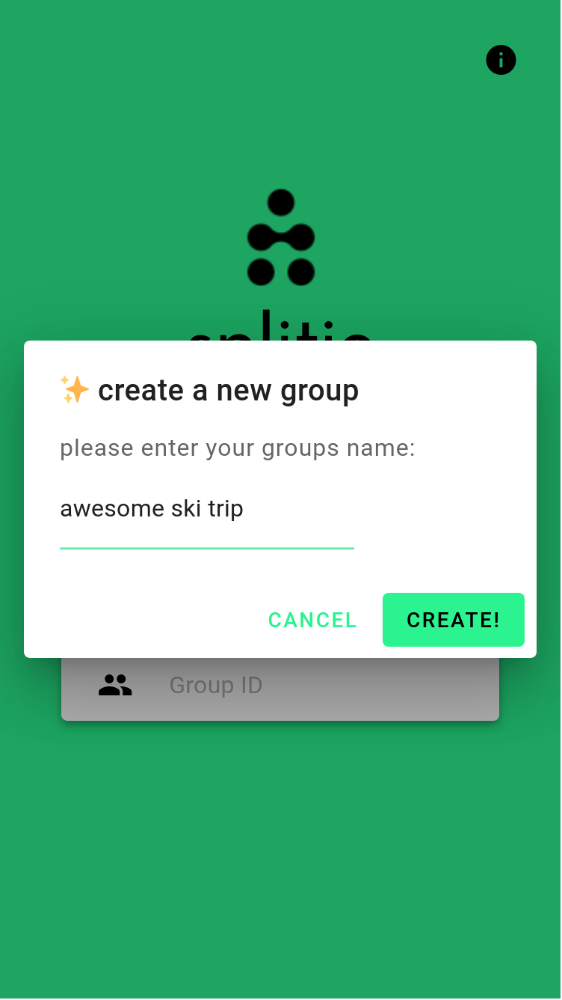
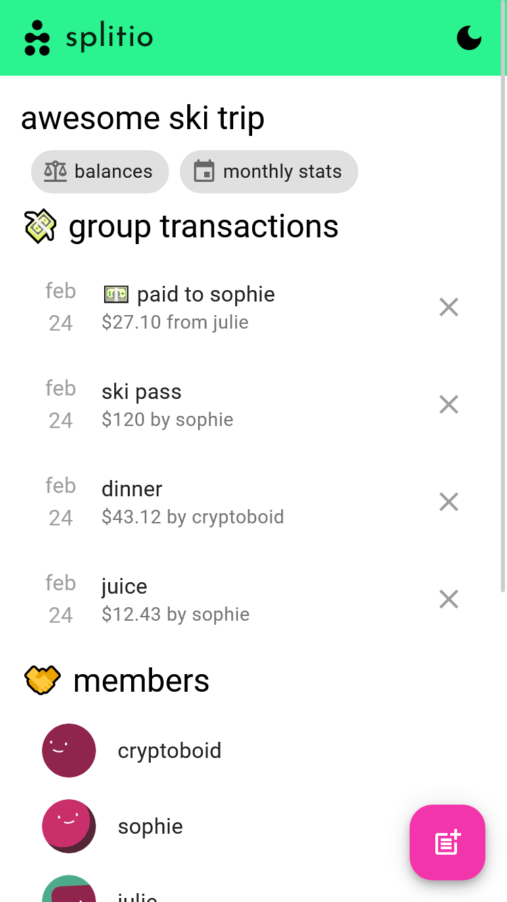
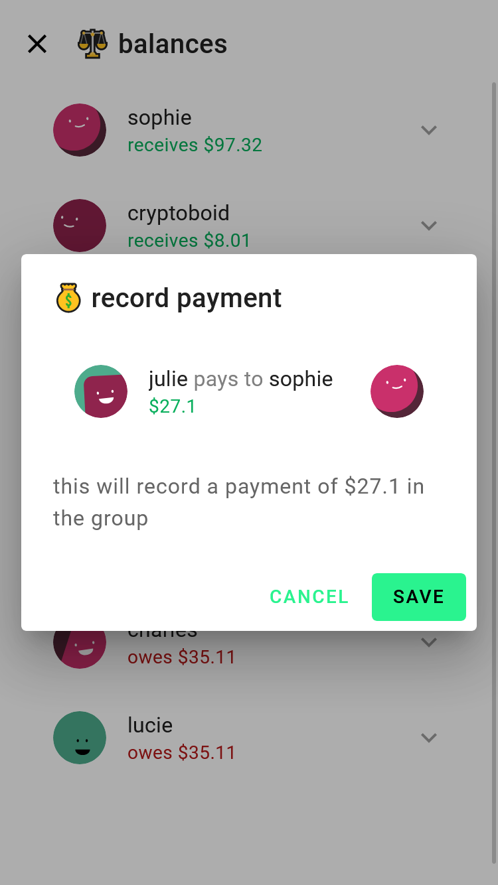

    
    <h1 align="center">splitio with friends</h1>

split your bills easily! splitio is a webapp built for tracking debts and
payments quickly, without any user accounts.

Information is p2p distributed using gun and end-to-end encrypted using gun/sea.

Built with SvelteKit and GunDB.

## 🚀 Features
- **P2P Distributed Data**
- All data on the app is stored in  a peer-to-peer network of users
- No need to create an account - just share  the link to invite others 
- Payment history can be viewed by anyone who knows the link 
- Encrypted payments using [gun/sea]
- Responsive design works well on mobile

## 📦 Installation &  Usage 
1. Clone this repo: `git clone  https://github.com/Amatun-nooor/splitio-with-friends` 
2. Navigate to the project directory:  `cd splitbill` 
3. Install dependencies: `npm install` or  `yarn` 
4. Start the development server: `npm run  dev` or `yarn dev`
5. Open  [http://localhost:3000](http://localhost:3000/) in your browser.

### Deploying to Vercel
You can deploy your own instance of splitbill using vercel's static site hosting service.
Just connect your GitHub repository to Vercel and it  will automatically build and deploy your application.
Make sure to add the following environment variables to your  Vercel deployment settings :
- `GUN_SECRET`: A secret key used for encrypting data (you can generate one using NodeJS).
- `APP_URL`: The URL where your app is hosted (e.g., "https://yourdomain.com"). This is needed so that users can receive payment links via email.
- `NODE_ENV`: Set this to  "production".
Note that you may encounter issues if you don't set these values as they are required for  the app to work properly.

## 🤔 how to use

1. Go to my website 
2. Create a group with any name
3. Send your friends the long url to start sharing bills! no accounts required.
4. Add members to the group by clicking on their avatar in the top right corner.
5. Click on the plus button in the bottom right to add items to the bill.Add expense details such as description,amount, who paid ,shares and how should the expense be split etc.
6. After entering all the details and adding it will show  up below as a bill item. Click on it to view more information. 
7. Click on balances to know the debt and total amount paid so far.
8. Each member can see all the other people involved in the bill and sees their own added items and the date on which they paid along with the person name who paid the amount.
9. To pay someone click on them and then click on the payment button. You will be prompt ed to enter the amount you owe.This will deduct  from your balance and mark the person as paid. 

## 🌟 showcase
<table>
<tr>
    
    
    

</tr>
<tr>
    
    
    

</tr>
</table>

## 💻 Local Development

## Method 1: npm

1. Download the repo `git clone `
2. Change the directory `cd splitio-with-friends`
3. Install the dependency `npm install`
4. Start a development server `npm run dev`
5. Open your browser and visit [http://localhost:3000](http://localhost:3000) to see App live

## Method 2: Docker

1. Download the repo `git clone`
2. Change the directory `cd splitio-with-friends`
3. Build the container `docker build -t splitio-with-friends .`
4. Start the container `docker run -p 3000:3000 splitio-with-friends`
5. Open your browser and visit [http://localhost:3000](http://localhost:3000) to see App live

## ❤️ contribute to https://github.com/Amatun-nooor/

